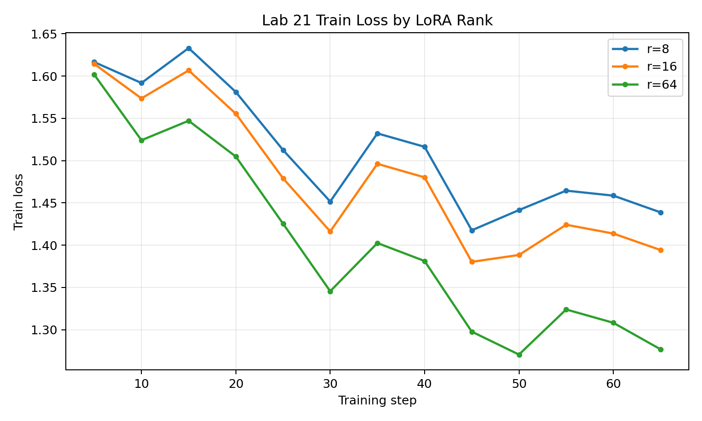

# Lab 21 - Báo cáo đánh giá LoRA / QLoRA Fine-tuning

**Học viên**: Nguyễn Bình Minh - 2A202600137  
**Ngày nộp**: 2026-05-07  
**Hình thức nộp**: **Option B - GitHub + Hugging Face Hub**  
**GitHub repo**: https://github.com/minh041104/lab21_2A202600137
**Hugging Face adapter**: https://huggingface.co/minh041104/qwen2.5-3b-vi-lab21-r16/tree/main

## 1. Setup

- **Base model**: `unsloth/Qwen2.5-3B-bnb-4bit`
- **Model class**: `Qwen2ForCausalLM`
- **Phương pháp fine-tuning**: QLoRA, base model được nạp ở 4-bit và chỉ huấn luyện LoRA adapter
- **Dataset**: `5CD-AI/Vietnamese-alpaca-gpt4-gg-translated`
- **Kích thước dataset**: 200 mẫu, chia 90/10 thành 180 mẫu train và 20 mẫu eval
- **Định dạng dữ liệu**: Alpaca style, gồm `instruction`, `input`, `output`, sau đó được map thành trường `text` cho SFT
- **Phân tích độ dài token**: p50 = 227, p95 = 562, p99 = 704
- **max_seq_length**: 1024, chọn theo p95 và giới hạn trong notebook T4
- **GPU**: Tesla T4, 1 GPU, max memory hiển thị trong notebook là 14.563 GB
- **Training config**: 3 epochs, batch size trên device = 1, gradient accumulation = 8, effective batch size = 8, learning rate = 2e-4, cosine schedule, `packing=False`
- **LoRA config chung**: `target_modules=["q_proj", "v_proj"]`, `lora_dropout=0`, `bias="none"`, task type `CAUSAL_LM`
- **Chi phí training ước tính**: tổng thời gian train 11.95 phút, chi phí khoảng **$0.07** với giá T4 tham chiếu $0.35/giờ. Con số này chưa tính thời gian setup, tải model/dataset và qualitative evaluation.

## 2. Rank Experiment Results

Kết quả được lấy từ `results/rank_experiment_summary.csv` trong artifact `lab21_results.zip`.

| Rank | Alpha | Trainable Params | Adapter Size | Train Time | Peak VRAM | Eval Loss | Perplexity |
|---:|---:|---:|---:|---:|---:|---:|---:|
| 8 | 16 | 1,843,200 | 7.39 MB | 3.92 min | 7.22 GB | 1.5577 | 4.7479 |
| 16 | 32 | 3,686,400 | 14.76 MB | 4.11 min | 6.62 GB | 1.5161 | 4.5544 |
| 64 | 128 | 14,745,600 | 59.00 MB | 3.92 min | 8.00 GB | 1.4768 | 4.3790 |
| Base | - | - | - | - | - | N/A | N/A |

Base model được dùng trong qualitative comparison, nhưng artifact hiện tại không có eval loss/perplexity của base model. Vì vậy báo cáo không tự tạo số liệu base. Nếu cần hoàn thiện thêm phần định lượng theo rubric, có thể chạy thêm `safe_evaluate()` trên base model với cùng eval set 20 mẫu và điền vào dòng Base.

Nhận xét chính:

- r=64 có perplexity tốt nhất: 4.3790, giảm 7.77% so với r=8 và 3.85% so với r=16.
- r=16 là điểm cân bằng tốt: perplexity tốt hơn r=8 khoảng 4.08% trong khi chỉ tăng thêm 1.84M trainable parameters.
- r=64 tăng 4 lần trainable params so với r=16 nhưng chỉ giảm thêm 0.1754 perplexity. Đây là dấu hiệu của diminishing returns khi tăng rank.
- Peak VRAM của r=16 thấp hơn r=8 trong log này có khả năng là do runtime variance hoặc CUDA cache. Về mặt lý thuyết, rank cao hơn thường cần nhiều bộ nhớ hơn, nên không nên kết luận rằng r=16 luôn tiết kiệm VRAM hơn r=8 từ một lần chạy duy nhất.

## 3. Loss Curve Analysis

Notebook chạy ở T4 mode nên tắt eval-during-training để tránh OOM. Vì vậy loss curve chỉ có train loss. Cả ba rank đều có xu hướng giảm loss qua 3 epochs:

- r=8: loss từ 1.6165 ở step 5 xuống 1.4388 ở step 65.
- r=16: loss từ 1.6143 xuống 1.3942.
- r=64: loss từ 1.6016 xuống 1.2768.

Đường r=64 nằm thấp nhất gần như trong toàn bộ quá trình train, phù hợp với eval perplexity tốt nhất. Tuy nhiên, do không có eval curve theo epoch, chưa thể kết luận chắc chắn về overfitting trong quá trình train. Dấu hiệu hiện có không cho thấy overfitting rõ ràng: train loss giảm, eval loss cuối cùng cũng giảm khi tăng rank. Với dataset chỉ có 180 mẫu train, r=64 có capacity lớn hơn đáng kể nên vẫn có rủi ro memorize nếu train lâu hơn hoặc dùng dataset hẹp hơn. Nếu triển khai thật, tôi sẽ thêm eval theo epoch hoặc dùng validation set lớn hơn để kiểm tra ổn định hơn.

## 4. Qualitative Comparison

Kết quả được lấy từ `results/qualitative_comparison.csv`. Fine-tuned model bên dưới là adapter r=16.

| # | Prompt | Base output (rút gọn) | Fine-tuned r=16 output (rút gọn) | Nhận xét |
|---:|---|---|---|---|
| 1 | Giải thích khái niệm machine learning cho người mới bắt đầu. | Giải thích machine learning là một phần của AI, học từ dữ liệu để dự đoán hoặc hành động, nhưng câu trả lời bị cắt ngang. | Diễn đạt machine learning là một bộ môn công nghệ máy tính học và cải thiện dự đoán từ dữ liệu, nhưng vẫn bị cắt ngang. | Fine-tuned mạch lạc hơn một chút, nhưng cả hai output đều chưa kết thúc trọn vẹn. |
| 2 | Viết đoạn code Python tính số Fibonacci thứ n. | Đưa hướng đệ quy và code, nhưng phần code bị dừng ở nhánh `else`. | Dùng cách lặp với `a, b = 0, 1`, có xử lý `n < 0`, nhưng vẫn bị cắt ở vòng lặp. | Fine-tuned tốt hơn về hướng giải và kiểm tra input, nhưng cần tăng `max_new_tokens` để output không bị truncate. |
| 3 | Liệt kê 5 nguyên tắc thiết kế UI/UX. | Liệt kê nguyên tắc thân thiện với người dùng, nhưng câu trả lời dài và bị cắt. | Liệt kê các mục như chuyển đổi, thích ứng, đơn giản, tương thích... ngắn gọn hơn. | Fine-tuned đáp ứng định dạng danh sách tốt hơn, nhưng một vài tên nguyên tắc còn thiếu chính xác. |
| 4 | Tóm tắt sự khác biệt giữa LoRA và QLoRA. | Giải thích LoRA/QLoRA là các phương pháp cải thiện mô hình NLP bằng biến đổi low-rank, còn mơ hồ. | Sai nghiêm trọng khi mở rộng LoRA thành "Layer-wise Adaptive Regularization Optimization". | Đây là case degraded. Fine-tuning với dataset general không sửa được kiến thức chuyên sâu về LoRA/QLoRA. |
| 5 | Phân biệt prompt engineering, RAG, và fine-tuning. | Nêu ba cách cải thiện hiệu suất mô hình, nhưng giải thích bị cắt. | Giải thích prompt engineering tập trung vào xây dựng prompt, RAG/fine-tuning chưa đủ rõ. | Fine-tuned có tone tự nhiên hơn nhưng vẫn thiếu độ chính xác nội dung. Cần thêm examples đúng domain fine-tuning/RAG vào dataset. |

Kết luận qualitative: adapter r=16 cải thiện phần nào về style tiếng Việt và format danh sách/code, nhưng không đảm bảo chính xác trên kiến thức chuyên môn nếu dataset training không phù hợp. Trường hợp LoRA vs QLoRA cho thấy fine-tuning không nên được dùng để bổ sung factual knowledge; nếu cần kiến thức đúng, nên dùng RAG hoặc thêm curated domain examples chất lượng cao.

## 5. Conclusion về Rank Trade-off

Trong thí nghiệm này, r=64 cho eval perplexity tốt nhất, nhưng r=16 là lựa chọn có ROI tốt nhất cho phần lớn tình huống deploy. Khi tăng từ r=8 lên r=16, số trainable parameters tăng từ 1.84M lên 3.69M và perplexity giảm từ 4.7479 xuống 4.5544, một cải thiện tương đối rõ với chi phí thêm nhỏ. Khi tăng tiếp từ r=16 lên r=64, adapter lớn hơn gấp 4 lần và peak VRAM cao hơn, nhưng perplexity chỉ giảm từ 4.5544 xuống 4.3790. Điều này thể hiện diminishing returns: rank cao hơn cho model thêm capacity để học pattern của dataset, nhưng lợi ích biên giảm khi dataset chỉ có 180 mẫu train. Nếu mục tiêu là benchmark perplexity trong lab, r=64 là kết quả tốt nhất. Nếu mục tiêu là upload, chia sẻ và deploy adapter gọn nhẹ, tôi chọn r=16 vì adapter chỉ khoảng 14.76 MB, train nhanh, chất lượng gần r=64 và ít rủi ro overfit hơn. r=8 phù hợp khi cần adapter nhỏ nhất, nhưng kết quả định lượng và qualitative đều kém hơn r=16.

## 6. What I Learned

- LoRA rank điều khiển capacity của adapter: rank cao hơn có thể giảm loss/perplexity, nhưng tăng tham số và kích thước adapter gần tuyến tính.
- QLoRA giúp train model 3B trên T4 bằng cách giữ base model ở 4-bit và chỉ train adapter nhỏ, phù hợp với lab và prototype chi phí thấp.
- Fine-tuning chủ yếu học style/format và pattern từ dataset. Nó không tự động sửa factual knowledge; các prompt về LoRA, QLoRA, RAG cần dataset domain tốt hơn hoặc kết hợp RAG.

## 7. Option B Submission Links

- **GitHub repo**: <điền link GitHub repo>
- **Hugging Face r16 adapter**: <điền link Hugging Face adapter>
- **Recommended adapter để nộp**: `r16`
- **Lý do chọn r16**: cân bằng tốt nhất giữa chất lượng, kích thước adapter và khả năng deploy.

## Files

- Metrics: `results/rank_experiment_summary.csv`
- Qualitative comparison: `results/qualitative_comparison.csv`
- Loss history: `results/loss_history.csv`
- Train loss plot: `results/loss_curve.png`
